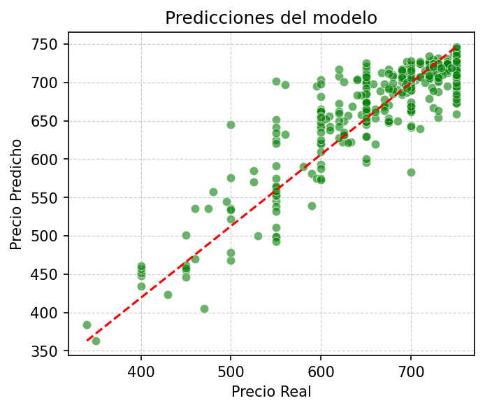

# Proyecto - Predicción de Precio de Viviendas 🏠💰

## Descripción del Proyecto
Este proyecto tiene como objetivo la predicción de precios de casas en Madrid utilizando un conjunto de datos sobre propiedades en alquiler. A través de diversas técnicas de Machine Learning, se procesaron los datos para desarrollar un modelo predictivo que estima el precio de las casas según sus características.

## Estructura del Proyecto
El proyecto está organizado de la siguiente manera:

```
├── datos/                                  # Datos originales y generados
│   ├── Iteration1/                         # Datos obtenidos de la primera iteración
│   ├── Iteration2/                         # Datos procesados y listos para el modelado
│   ├── Iteration3/                         # Resultados de la tercera iteración
│   ├── api_rent_madrid.csv                 # Datos originales obtenidos de la API
│   ├── clean_data.csv                      # Datos tratados y listos para modelar
│   ├── metricas_finales.csv                # Métricas del modelo final
├── img/                                    # Imágenes de las gráficas
│   ├── banner.png                          # Imagen de Streamlit
│   ├── model_performance.png               # Gráfico del comportamiento del modelo final
├── models/                                 # Modelos entrenados y sus configuraciones
│   ├── encoder_onehot.pkl                  # Codificador One-Hot para variables categóricas
│   ├── encoder_target.pkl                  # Codificador para la variable objetivo
│   ├── model.pkl                           # Modelo entrenado (por ejemplo, Random Forest o Gradient Boosting)
│   ├── scaler.pkl                          # Escalador para las características numéricas
├── notebooks/                              # Notebooks Jupyter para EDA y análisis
│   ├── Iteration1/                         # Análisis y procesamiento de la primera iteración de datos
│   │   ├── 1_eda.ipynb                     # Análisis exploratorio de datos (EDA)
│   │   ├── 2-preprocessing.ipynb           # Preprocesamiento de datos
│   │   ├── 3-model.ipynb                   # Entrenamiento y evaluación de modelos
│   ├── Iteration2/                         # Análisis y procesamiento de la segunda iteración de datos
│   ├── Iteration3/                         # Análisis y procesamiento de la tercera iteración de datos
├── page/                                   # Scripts y archivos relacionados con la implementación web
│   ├── main.py                             # Script principal para la interfaz en Streamlit
├── src/                                    # Scripts para procesamiento, modelado y funciones de apoyo
│   ├── support_encoding.py                 # Funciones para codificación de variables
│   ├── support_model.py                    # Funciones para la creación y entrenamiento de modelos
│   ├── support_plots.py                    # Funciones para generar gráficos
│   ├── support_pre.py                      # Funciones para el preprocesamiento de datos
└── README.md                               # Documentación del proyecto


```
### Requisitos

- Python 3.7 o superior 🐍
- [Anaconda](https://www.anaconda.com/products/distribution) o [Miniconda](https://docs.conda.io/en/latest/miniconda.html) (opcional, pero recomendado)

### Paquetes Necesarios

El proyecto utiliza los siguientes paquetes:

- [`pandas`](https://pandas.pydata.org/pandas-doc/stable/): Para la manipulación y análisis de datos.
- [`numpy`](https://numpy.org/doc/stable/): Para operaciones numéricas y manejo de arrays.
- [`matplotlib`](https://matplotlib.org/stable/users/index.html): Para la visualización de datos.
- [`seaborn`](https://seaborn.pydata.org/): Para visualización estadística de datos.
- [`scikit-learn`](https://scikit-learn.org/stable/): Para el desarrollo de modelos de Machine Learning.
- [`category_encoders`](https://contrib.scikit-learn.org/category_encoders/): Para la codificación de variables categóricas.
- [`tqdm`](https://tqdm.github.io/): Para mostrar barras de progreso en loops.

### Instalación

1. **Clona el repositorio:**

   ```bash
   git clone https://github.com/yanruwu/Proyecto-PrediccionCasas
   cd Proyecto-Recetas
2. **Instala las librerías**
   ```bash
   pip install module_name
## Progreso del Proyecto

### Iteración 1: Primer approach

- **Análisis Exploratorio de los Datos (EDA)**: Se comenzó realizando un análisis de los datos, eliminando duplicados y obteniendo información sobre éstos para su posterior uso.
- **Preprocesamiento de los Datos**: Se prepararon los datos antes del entrenamiento del modelo, pasando por encodings, feature scaling y tratamiento de outliers.
- **Entrenamiento del Modelo**: Se entrenaron algunos de los modelos, seleccionando aquellos con mayor posibilidad de éxito para las próximas iteraciones.

### Iteración 2: Evolución en la elección de variables

- **Preprocesamiento de los Datos**: Se modificaron los datos antes del entrenamiento del modelo con respecto a la iteración anterior, modificando las VP y variando los métodos de preprocesamiento.
- **Entrenamiento del Modelo**: Se volvieron a entrenar algunos modelos, esta vez teniendo en cuenta los hiperparámetros y variables que se seleccionaron tanto en la primera iteración como en el nuevo preprocesamiento.

### Iteración 3: Implementación de los cambios y modelo final

- **Preprocesamiento de los Datos**: Se volvió a iterar sobre el preprocesamiento, basándolo en lo aprendido en anteriores iteraciones.
- **Entrenamiento del Modelo**: Se entrenó al modelo final, se reentrenó con la muestra completa de los datos, se almacenó en un archivo pkl, junto con el resto de objetos de transformación generados durante la iteración para su posterior uso en la predicción.

### Implementación Web

- **Desarrollo de la aplicación web**: Usando Streamlit, se desarrolló una interfaz interactiva donde los usuarios pueden cargar datos de una vivienda y obtener una predicción según nuestro modelo.

## Conclusión

Hemos creado un modelo capaz de predecir el precio de un alquiler de vivienda con un RMSE de 37.90 €. Las predicciones sobre los datos de entrenamiento se logran ajustar con un $r^2$ = 0.78, resultando en:




## Próximos Pasos

- **Mejora de las métricas**: Es necesario solucionar el aún existente overfitting en nuestro modelo, implementando otras variables descartadas o ajustando más finamente los hiperparámetros.
- **Simplificar las VP**: Actualmente para predecir un precio son necesarios muchos datos que pueden carecer de coherencia a la hora de saber el precio de una vivienda, como podría ser ``has360``, que indica si el anuncio tiene un tour 360º. Ésto no es inherente de la vivienda sino del anuncio, que se debería publicar tras evaluar el precio. 
- **Generalización y modularización**: Sería conveniente crear una hiperclase que agrupara todos los procesos seguidos en el proyecto, con el fin de poder realizar iteraciones de una forma mucho más eficiente.

